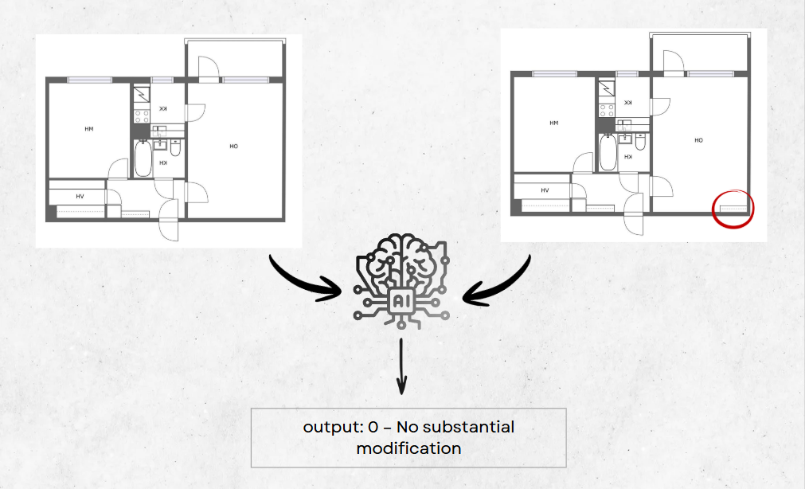
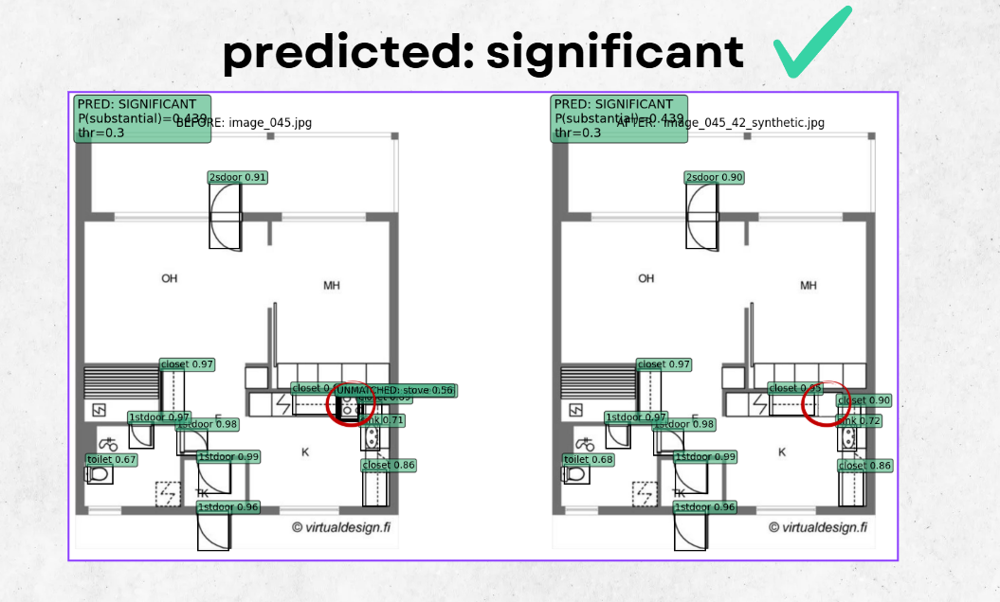

# Built-in – A GenAI-Based System for Verifying Compliance Between Floorplan Versions

Automated detection and classification of substantial architectural changes using synthetic data and computer vision.


# 1. Project Motivation

Comparing different versions of the same floorplan is difficult for buyers and may lead to financial and legal risks. 
Therefore, we decided to create an automated system that highlights and classifies changes between floorplan versions in a clear and reliable way.

# 2. Problem statement 

While engineers and construction companies possess the expertise to interpret floorplan changes, regular homebuyers typically lack both the professional knowledge and the appropriate tools to accurately compare different versions of the same floorplan. As a result, consumers are often unable to identify whether observed differences represent meaningful layout changes.
This project aims to provide an automated tool designed to assist consumers in identifying and understanding changes between floorplan versions.

# 3. Visual abstract




# 4. Datasets used or collected

* We used [FloorPlansV2](https://huggingface.co/datasets/jprve/FloorPlansV2) dataset as the base data source, applying filtering and preprocessing steps.
* On top of this data, we generated a synthetic before/after dataset containing both substantial and non-substantial changes for classification.

# 5. Data augmentation and generation methods

Synthetic Data Generation Pipeline To overcome the scarcity of labeled "Before/After" floor plan pairs, we developed an automated pipeline to generate synthetic architectural changes. The process consists of four stages:

1. **Object Detection:** We utilized a fine-tuned DETR (DEtection TRansformer) model to identify semantic architectural elements (e.g., stoves, sinks, toilets, doors) within original floor plans.

2. **Semantic Segmentation:** Detected bounding boxes were passed to the Segment Anything Model (SAM) to generate precise, pixel-perfect masks, isolating objects from the floor plan background.

3. **Image Manipulation:** We applied programmatic transformations to simulate realistic renovations:

 * **Removal:** Objects were digitally erased and inpainted with background textures.

 * **Addition:** New objects (e.g., closets) were inserted using a logic-based algorithm that identifies valid wall-adjacent locations.

 * **Replacement:** Functional fixtures (e.g., toilets) were swapped with other appliances (e.g., stoves) using a patch-based synthesis approach.

4. **Automated Labeling:** Each generated pair was automatically labeled as "Substantial" or "Non-Substantial" based on the manipulation type, creating a fully annotated dataset for supervised learning.

 * **Substantial changes:** remove sink, remove stove, remove toilet, replace sink with stove and replace toilet with stove .
 
 * **Non-Substantial changes:** add closet at random location, remove 1 sided door, remove 2 sided door and remove closet .

# workflow visualization:


# 6. Input/Output Examples





# 7. Models and pipelines used 

1. **Synthetic Data Generation Pipeline**
To address the lack of labeled architectural change datasets, we constructed a generative pipeline to create valid "Before & After" floor plan pairs:

 * **Object Detection (DETR):** We fine-tuned the DEtection TRansformer (DETR) model on a floor plan dataset to identify semantic entities such as stoves, sinks, toilets, and doors.

 * **Semantic Segmentation (SAM):** Detected bounding boxes were processed by the Segment Anything Model (SAM, ViT-H) to generate high-precision segmentation masks, enabling clean extraction of objects from the background.

 * **Image Manipulation Engine:** Custom Python scripts (using OpenCV and PIL) utilized the segmentation masks to algorithmically remove, replace, or add objects, automatically labeling each transformation as "Substantial" or "Non-Substantial."

2. Change Classification Pipeline
The core system for detecting discrepancies in real-world scenarios operates as follows:

 * **Parallel object Detection:** The system processes both the "Original" and "Revised" floor plans in parallel using the fine-tuned DETR model to extract object layouts.

 * **Feature Extraction (Hungarian Matching):** We employed the Hungarian Algorithm to solve the linear assignment problem, matching objects between the two images based on intersection-over-union (IoU) and spatial distance. This yields a feature vector representing the global similarity and specific object displacements.

 * **Binary Classifier:** A Logistic Regression model classifies the extracted feature vector. It outputs a probability score determining whether the detected changes are "Substantial" (requiring alerts) or "Non-Substantial" (cosmetic or minor), optimized with a decision threshold of 0.3 for maximum recall & F1 score.


# 8. Training process and parameters

1. **Object Detector Fine-tuning (DETR)**
We utilized a pre-trained DETR (ResNet-50 backbone) model and fine-tuned it on a custom annotated dataset of architectural floor plans(COCO).

 * **Objective:** To recognize specific classes: Stove, Sink, Toilet, 1 Sided Door, 2 Sided Door and Closet.

 * **Optimization:** The model was trained using the Hungarian Loss (combining classification and bounding box regression loss) to handle set prediction.

2. **Change Classifier Training**
The binary classification model ("Substantial" vs. "Non-Substantial") was trained on the synthetically generated dataset.

* **Dataset Split:** The dataset of floorplans pairs was split into 80% Training and 20% Validation, ensuring no data leakage between scene groups.

* **Feature Engineering:** For every image pair, we computed a feature vector based on the Hungarian Matching cost matrix between the "Before" and "After" detections. Key hyperparameters included:

  * **Label Mismatch Penalty:** A high penalty was assigned to differing object types to strictly enforce that the system matches objects of the same class (e.g., ensuring a stove is not matched with a toilet).

  * **Center Distance Penalty:** A low distance weight was used to allow for flexibility, recognizing that objects often shift positions slightly during legitimate renovations.

  * **Detection Confidence Threshold:** A permissive (low) threshold was selected to prioritize Recall, ensuring that even faint or sketched objects are detected and analyzed rather than ignored.

* **Model Configuration:** A Logistic Regression classifier was trained with:

 * ```class_weight="balanced"``` to handle potential class imbalances.

 * ```max_iter=2000``` to ensure convergence.

* **Threshold Optimization:** We performed a precision-recall sweep on the validation set. While the standard decision threshold is 0.5, we identified an optimal threshold of 0.30.

 * **Result:** This adjustment improved the Recall to 96% (virtually eliminating missed substantial changes) and achieved a final **F1-Score of 0.81**.


# 9. Metrics 

To evaluate the performance of the Change Type Classifier, we utilized standard binary classification metrics, prioritizing the minimization of false negatives (missed substantial changes).

* **Recall (Sensitivity):** This was our primary success metric. In the context of floor plan verification, missing a "Substantial Change" (e.g., a missing stove) poses a significant legal risk.

 * Formula: $Recall = \frac{TP}{TP + FN }$

 * Result: By optimizing the decision threshold to 0.30, we achieved a Recall of **96.2%**, ensuring that nearly all critical discrepancies are flagged.

* **F1-Score:** We used the F1-Score (the harmonic mean of Precision and Recall) to determine the optimal decision threshold during the training sweep.

 * Formula:  $F1 = 2 \cdot \frac{Precision \cdot Recall}{Precision + Recall}$

 * Result: The model achieved a peak **F1-Score of 0.81**, balancing the need to detect changes without overwhelming the user with false alarms.

* **Intersection over Union (IoU):** utilized during the feature extraction phase (Hungarian Matching). It measures the spatial overlap between the bounding boxes of matched objects in the "Before" and "After" plans to quantify displacement. 

 * Formula: $IoU = \frac{Area\_of\_Intersection}{Area\_of\_Union}$

* **Confusion Matrix:** Analyzed to visualize the trade-off between "False Alarms" (False Positives) and "Missed Detections" (False Negatives) at the chosen threshold.


# 10. Results

We evaluated the proposed change detection pipeline on a held-out validation set of 686 floor plan pairs (20% of the dataset). The testing focused on the system's ability to correctly classify architectural changes as either "Substantial" or "Non-Substantial."

1. Classification Performance The Logistic Regression classifier, operating on features extracted from the Hungarian Matching algorithm, demonstrated robust performance. Through a threshold optimization sweep, we identified 0.30 as the optimal decision boundary (default=0.5), yielding the following results:

* **Recall (Sensitivity): 96.2%** for substantial changes. This high recall confirms the system's reliability as a safety net, missing fewer than 4% of critical alterations.

* **F1-Score: 81.5%**, indicating a strong balance between precision and recall.

* **Precision: 70.7%**, reflecting a deliberate trade-off where the system accepts a higher false-positive rate (alerting on some minor changes) to ensure no critical changes are overlooked.

2. Confusion Matrix Analysis At the chosen threshold of 0.30:

* **True Positives (Correct Alerts):** 1790 pairs.

* **False Negatives (Missed Alerts):** 71 pairs.

* **True Negatives (Correct Rejections):** 663 pairs.

* **False Positives (False Alarms):** 740 pairs.

3. **Qualitative Assessment** Visual inspection of the output confirms that the pipeline successfully localizes changes. The system accurately highlights removed or shifted objects (e.g., stoves, toilets) with bounding boxes, while correctly ignoring minor discrepancies such as slight pixel noise or irrelevant background shifts.


# 11. Repository structure

```bash
Built-in 
├── Code/
│   ├── Synthetic_Data_Generation.ipynb    # Generates synthetic training data (using DETR + SAM)
│   ├── CreateLabelPics.ipynb      # Objects croping and ordering for the pairs generation    
│   ├── DETR_Finetuning.ipynb  # DETR fine-tuning pipeline
│   |      *
│   |      *
|   |      * 
|   └── train_change_classifier.ipynb # Change type classifier training and executing
|
├── Data/
|   ├── annotations_DETR/merged_annotations0-460.json # Annotated floorplans for the DETR training
│   ├── images_before/                        # Original floor plan images
│   ├── images_after/                         # Synthetically modified images (Deleted/Moved objects)
│   └── metadata.jsonl                        # Ground truth labels mapping pairs to "Substantial" or "Non-Substantial"
│
├── Models/ (not included in the repository, download through the models installtion guide below)
│   ├── detr-finetuned-floorplans/            # The fine-tuned DETR model files (config, weights)
│   └── ChangeTypeClassifier/
│   |   └── change_classifier_logreg.pkl      # The saved binary classifier (Pickle file)
│   └── Sam_Checkpoint/
|       └── sam_vit_h_4b8939.pth              # The segment anything model
|
├── Results/                                  # The evaluation results 
|      
├── Slides/                                   # The project presentions 
| 
├── Visuals/                                  # Photos of the evaluation results
|
├── setup_env.bat                             # Enviorment and models setup (run before starting)
|
├── requirements.txt                      # List of Python dependencies
└── README.md                                 # Project documentation
```
# 12. Team Members

* Afik Aharon
* Adi Haim
* Liran Aichnboim

# Models Installation Guide

This project uses several **large pre-trained models** that are **not included in the Git repository**
due to size limitations.  
All models are hosted on **Hugging Face** and are downloaded automatically.

---

##  Required Models

The following models are used in the project:

- **Change Type Classifier**  
  https://huggingface.co/AdiHaim/ChangeTypeClassifier

- **SAM Checkpoint**  
  https://huggingface.co/AdiHaim/Sam_Checkpoint

- **DETR Fine-Tuned for Floorplans**  
  https://huggingface.co/AdiHaim/detr-finetuned-floorplans

---

##  Automatic Installation (Recommended)

Run the setup script from the project root directory in the terminal:

```bash
setup_env.bat
```
